# AUTONOMOUS QUOTE AGENTS — Comprehensive Technical Documentation

### KodryxAI Hackathon 2026 · Use Case 3 · Multi-Agent Insurance Pipeline

---

## Table of Contents

1. [Executive Summary](#1-executive-summary)
2. [Problem Statement & Business Context](#2-problem-statement--business-context)
3. [Solution Architecture & Diagrams](#3-solution-architecture)
4. [Dataset Analysis](#4-dataset-analysis)
5. [Feature Engineering](#5-feature-engineering)
6. [Agent 1 — Risk Profiler (CatBoost)](#6-agent-1--risk-profiler-catboost)
7. [Agent 2 — Conversion Predictor (CatBoost)](#7-agent-2--conversion-predictor-catboost)
8. [Agent 2 — Model Comparison & Signal Analysis](#8-agent-2--model-comparison--signal-analysis)
9. [Agent 3 — Premium Advisor (Groq LLM + Rules)](#9-agent-3--premium-advisor-groq-llm--rules)
10. [Agent 4 — Decision Router (LLM + Rules)](#10-agent-4--decision-router-llm--rules)
11. [Explainability Stack (4+2 Methods)](#11-explainability-stack-42-methods)
12. [LangGraph Pipeline Orchestration](#12-langgraph-pipeline-orchestration)
13. [Regional & Channel Intelligence](#13-regional--channel-intelligence)
14. [Backend API Architecture](#14-backend-api-architecture)
15. [Frontend Dashboard](#15-frontend-dashboard)
16. [Technology Stack](#16-technology-stack)
17. [Why Bind Prediction Stayed Weak — Honest Assessment](#17-why-bind-prediction-stayed-weak--honest-assessment)
18. [What We Did Right — Defense Points](#18-what-we-did-right--defense-points)
19. [Production Roadmap](#19-production-roadmap)
20. [Project Structure](#20-project-structure)

### Diagram Index

| # | Diagram | Section | Type |
|---|---------|---------|------|
| 3.1 | End-to-End System Architecture | §3 | Mermaid graph TB |
| 3.2 | Pipeline Flow (LangGraph StateGraph) | §3 | Mermaid flowchart |
| 3.3 | Data Flow — Input to Output | §3 | Mermaid flowchart LR |
| 3.4 | API Request / Response Sequence | §3 | Mermaid sequence |
| 3.5 | Explainability Architecture | §3 | Mermaid flowchart TB |
| 3.6 | Frontend Component Hierarchy | §3 | Mermaid graph TD |
| 3.7 | Decision Routing Flowchart (Agent 4) | §3 | Mermaid flowchart |
| 3.8 | ML Training & Artifact Pipeline | §3 | Mermaid flowchart LR |
| 9.1 | Agent 3 Hybrid Architecture | §9 | Mermaid flowchart |
| 12.1 | LangGraph State Diagram | §12 | Mermaid stateDiagram |
| 13.1 | Regional Threshold Resolution | §13 | Mermaid flowchart LR |
| 14.1 | SSE Streaming Architecture | §14 | Mermaid sequence |
| 15.1 | Pipeline Stepper Visualization | §15 | Mermaid flowchart LR |
| C.1 | Notebook Run Order | Appendix C | Mermaid flowchart |

---

## 1. Executive Summary

**Autonomous Quote Agents** is a multi-agent AI system that automates the auto insurance quote evaluation pipeline. The system processes quotes through four specialized agents — profiling risk, predicting conversion, analyzing premium suitability, and routing decisions — requiring human intervention **only** when the system identifies high risk or uncertainty.

### Key Numbers

| Metric | Value |
|--------|-------|
| Dataset | 146,259 quotes (25 columns) |
| Bind rate (class imbalance) | 22.22% (1:3.5 ratio) |
| Agent 1 accuracy (risk tier) | 100% (deterministic target) |
| Agent 2 best PR-AUC (bind) | 0.2242 (near base rate — data-limited) |
| Explainability methods | 6 (SHAP, LIME, Anchors, DiCE, LLM CoT, Structured Summary) |
| Pipeline orchestration | LangGraph StateGraph with conditional routing |
| LLM integration | Groq Llama 3.3 70B Versatile |
| Frontend | Next.js 16 + shadcn/ui + Recharts (34 components) |
| Real-time streaming | Server-Sent Events (SSE) |

### One-Line Summary

> A four-agent LangGraph pipeline that classifies risk via CatBoost, predicts conversion via CatBoost+SMOTE, advises on premiums via Groq LLM, and routes quotes to auto-approve, follow-up, or human escalation — with full explainability (SHAP/LIME/Anchors/DiCE) computed live at inference time for every quote.

---

## 2. Problem Statement & Business Context

### The Problem

Auto insurance carriers process thousands of quotes daily through **Exclusive Agents (EA)** and **Independent Agents (IA)** across multiple regions. Only **1 in 5** quotes (~22%) converts to a bound policy. Every unconverted quote currently demands manual human investigation — this creates:

- **Operational bottlenecks** — underwriting teams cannot scale with quote volume
- **Delayed decisions** — manual review adds days to the quote lifecycle
- **Inconsistent outcomes** — different underwriters may route identical quotes differently
- **Missed conversions** — viable quotes expire before follow-up occurs

### The Goal

Build an intelligent pipeline capable of:

1. **Assessing the risk profile** of each quote
2. **Predicting the likelihood** of policy conversion (bind)
3. **Determining whether the quoted premium** prevents conversion
4. **Automatically routing quotes** to approval, follow-up, or underwriting escalation

Human intervention is required **only** when the system identifies high risk, low confidence, or suspicious patterns.

### Business Impact

| Decision | What Happens | Human Involved? |
|----------|-------------|-----------------|
| **AUTO_APPROVE** | Quote is approved instantly | No |
| **AGENT_FOLLOWUP** | Agent receives nudge to contact customer | No (automated suggestion) |
| **ESCALATE_UNDERWRITER** | Full case summary sent to underwriter queue | Yes — informed review |

---

## 3. Solution Architecture

### High-Level Flow

> **See Diagrams 3.1–3.8 below** for comprehensive Mermaid-renderable system architecture, pipeline flow, data flow, API sequence, explainability architecture, frontend hierarchy, decision routing, and ML training pipeline diagrams.

**Pipeline summary (text):**
```
Quote Input (25 fields)
    → Agent 1: Risk Profiler (CatBoost) → risk_tier + 4 XAI explanations
    → Agent 2: Conversion Predictor (CatBoost+SMOTE) → bind_score + 4 XAI explanations
    → [IF bind_score > threshold] Agent 3: Premium Advisor (Groq LLM + Rules) → premium_flag
    → Agent 4: Decision Router (LLM + Rules + Regional) → AUTO_APPROVE / AGENT_FOLLOWUP / ESCALATE
```

### System Architecture — Mermaid Diagrams

#### 3.1 End-to-End System Architecture

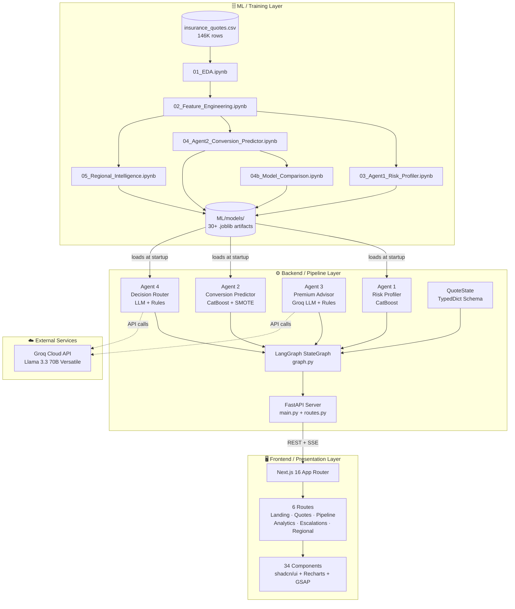

#### 3.2 Pipeline Flow (LangGraph StateGraph)

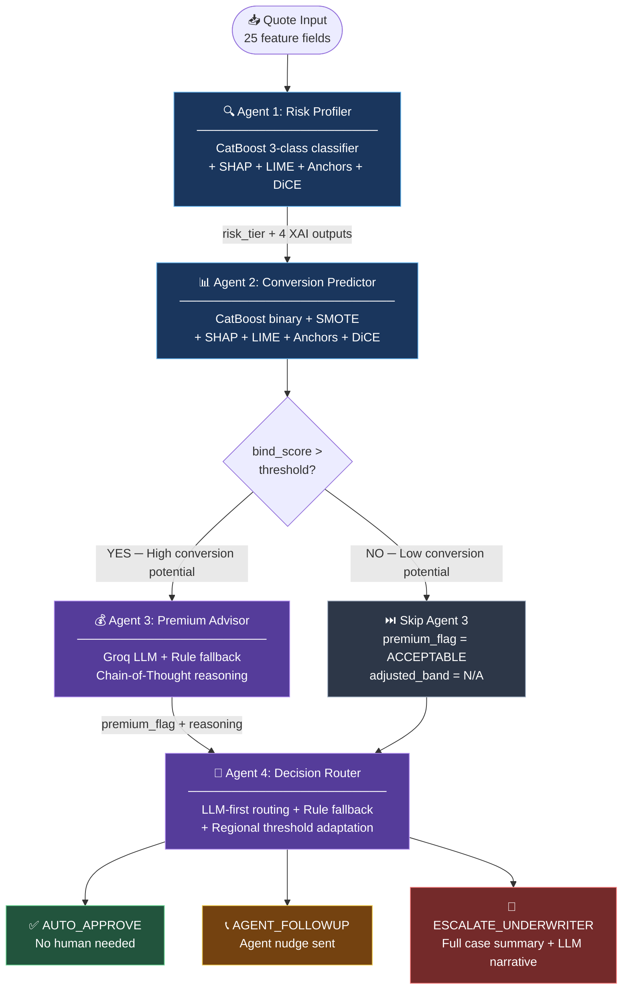

#### 3.3 Data Flow — Input to Output

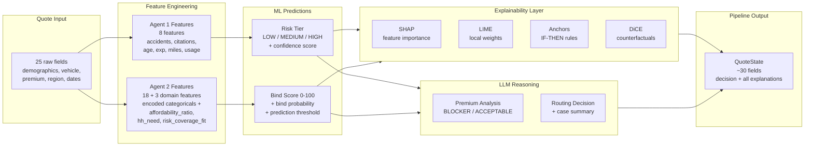

#### 3.4 API Request / Response Sequence

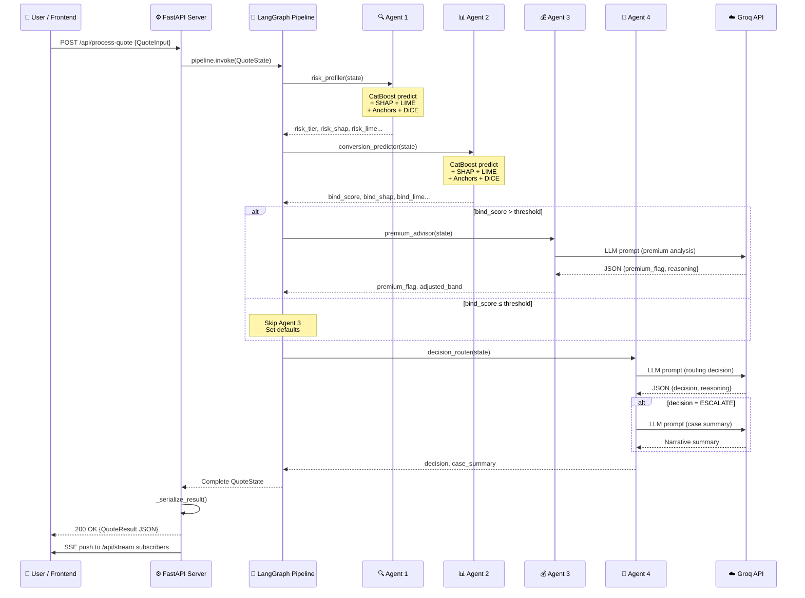

#### 3.5 Explainability Architecture

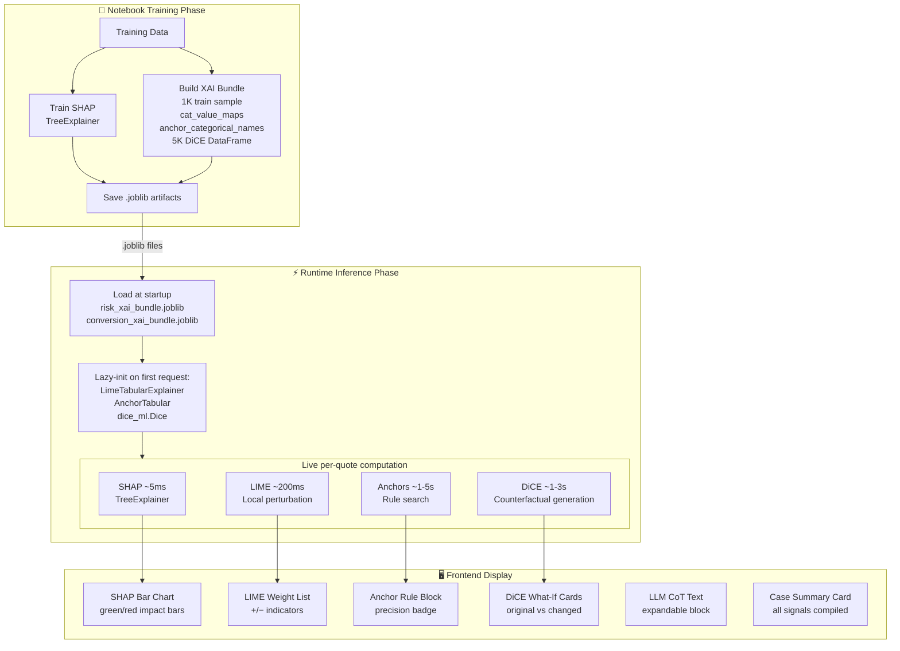

#### 3.6 Frontend Component Hierarchy

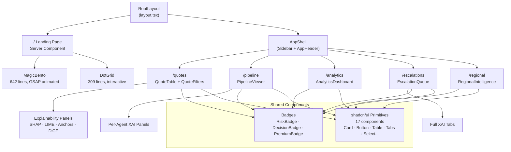

#### 3.7 Decision Routing Flowchart (Agent 4)

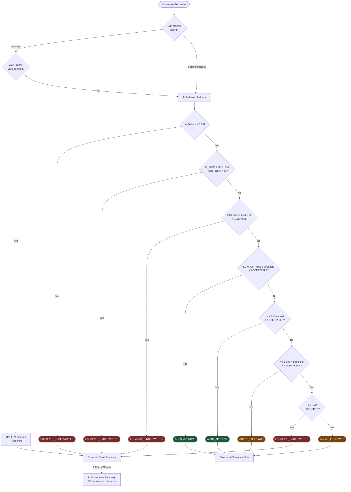

#### 3.8 ML Training & Artifact Pipeline

```mermaid
flowchart LR
    subgraph NB01["01_EDA"]
        EDA[Exploratory Analysis<br/>distributions, correlations,<br/>bind rate analysis]
    end

    subgraph NB02["02_Feature_Engineering"]
        FE_RISK[Risk tier engineering<br/>composite scoring]
        FE_ENCODE[Categorical encoding<br/>ordinal + label]
        FE_SPLIT[Stratified 80/20 split]
        FE_SAVE[Save artifacts:<br/>feature_config.joblib<br/>label_encoders.joblib<br/>ordinal_maps.joblib<br/>train.parquet<br/>test.parquet]
    end

    subgraph NB03["03_Agent1_Risk_Profiler"]
        A1_TRAIN[CatBoost 3-class<br/>200 iterations, depth=5]
        A1_SHAP[SHAP TreeExplainer]
        A1_XAI[XAI Bundle<br/>LIME + Anchors + DiCE data]
        A1_SAVE[Save:<br/>risk_model.joblib<br/>risk_explainer.joblib<br/>risk_xai_bundle.joblib]
    end

    subgraph NB04["04_Agent2_Conversion"]
        A2_SMOTE[SMOTE 22% → 50/50]
        A2_TRAIN[CatBoost binary<br/>+ domain features]
        A2_THRESH[Threshold sweep<br/>guardrailed calibration]
        A2_XAI[XAI Bundle + DiCE]
        A2_SAVE[Save:<br/>conversion_model.joblib<br/>conversion_explainer.joblib<br/>conversion_xai_bundle.joblib]
    end

    subgraph NB04b["04b_Model_Comparison"]
        MODELS[6 architectures tested:<br/>Ridge · RF · CatBoost<br/>MLP · FT-Transformer · Ensemble]
        RESULT_COMP[All ~0.50 ROC-AUC<br/>Data-limited ceiling confirmed]
        COMP_SAVE[Save:<br/>conversion_model_comparison_bundle.joblib]
    end

    subgraph NB05["05_Regional_Intelligence"]
        REG_CALC[Per-region bind rates<br/>EA vs IA analysis]
        REG_THRESH[Dynamic threshold<br/>computation]
        REG_SAVE[Save:<br/>regional_stats.joblib]
    end

    EDA --> FE_RISK --> FE_ENCODE --> FE_SPLIT --> FE_SAVE
    FE_SAVE --> A1_TRAIN --> A1_SHAP --> A1_XAI --> A1_SAVE
    FE_SAVE --> A2_SMOTE --> A2_TRAIN --> A2_THRESH --> A2_XAI --> A2_SAVE
    A2_SAVE --> MODELS --> RESULT_COMP --> COMP_SAVE
    FE_SAVE --> REG_CALC --> REG_THRESH --> REG_SAVE
```

### Orchestration

The pipeline is implemented as a **LangGraph StateGraph** — a directed graph where each agent is a node that receives a typed state dictionary, enriches it with its outputs, and passes it to the next node. Conditional edges allow Agent 3 to be skipped for low-conversion quotes.

---

## 4. Dataset Analysis

### Overview

| Property | Value |
|----------|-------|
| File | `insurance_quotes.csv` |
| Rows | 146,259 |
| Columns | 25 |
| Target variable | `Policy_Bind` (Yes/No) |
| Bind rate | 22.22% (32,502 Yes / 113,757 No) |
| Class imbalance ratio | 1:3.50 |
| Regions | 8 (A–H), evenly distributed (~18K each) |
| Agent types | EA (71%) / IA (29%) |

### Column Inventory

| Column | Type | Used By Agent | Notes |
|--------|------|---------------|-------|
| `Quote_Num` | ID | All | Unique quote identifier |
| `Agent_Type` | Categorical (EA/IA) | A2, A4 | Exclusive vs Independent agent |
| `Q_Creation_DT` | Date | A2 | Quote creation timestamp |
| `Q_Valid_DT` | Date | A2 | Quote expiry — urgency signal |
| `Policy_Bind_DT` | Date | Target derivation | Null if not bound (113,757 nulls) |
| `Region` | Categorical (A–H) | A2, A4 | Geographic signal |
| `HH_Vehicles` / `HH_Drivers` | Numeric | A1 | Household complexity |
| `Driver_Age` / `Driving_Exp` | Numeric | A1 | Risk signals |
| `Prev_Accidents` / `Prev_Citations` | Numeric | A1 | Core risk features |
| `Sal_Range` / `Coverage` | Categorical | A2, A3 | Affordability signals |
| `Quoted_Premium` | Numeric | A3 | Key pricing input |
| `Policy_Bind` | Binary (Yes/No) | Target | 22% positive class |
| `Gender` / `Marital_Status` / `Education` | Categorical | A2 | Demographic features |
| `Veh_Usage` / `Annual_Miles_Range` | Categorical | A1 | Vehicle usage patterns |
| `Vehicl_Cost_Range` / `Policy_Type` | Categorical | A2, A3 | Vehicle value context |
| `Re_Quote` | Binary (Yes/No) | A2 | Whether this is a repeat quote |

### Key EDA Findings

| Finding | Detail | Implication |
|---------|--------|-------------|
| `urgency_days` is constant | Every quote has exactly 59-day validity | Zero predictive signal for Agent 2 — SHAP correctly assigns near-zero importance |
| Regional bind rates nearly flat | Range: 22.08%–22.56% (~0.48pp spread) | Region adds minimal discrimination for bind prediction |
| EA vs IA bind rates nearly identical | EA: 22.16%, IA: 22.38% | Agent channel adds minimal discrimination |
| Coverage bind rates flat | Basic: 22.0%, Balanced: 22.1%, Enhanced: 22.3% | Coverage type doesn't meaningfully predict bind |
| Days-to-bind (bound quotes only) | Mean: 16 days, Std: 8.9, Range: 1–31 | Conversion typically happens within 2 weeks |
| No missing data | Only `Policy_Bind_DT` has nulls (expected for unbound quotes) | Clean dataset, no imputation needed for features |

---

## 5. Feature Engineering

### Notebook: `02_Feature_Engineering.ipynb`

All feature engineering is done in a dedicated notebook and artifacts are saved for downstream consumption.

### Risk Tier Engineering (Agent 1 Target)

No ground-truth risk label exists in the dataset. We engineer `risk_tier` from actuarial signals using a composite scoring approach:

```
Composite Risk Score = 
    Prev_Accidents × 30
  + Prev_Citations × 20
  + f(Driver_Age brackets)
  + f(Driving_Exp brackets)
  + f(Annual_Miles_Range ordinal)
  + f(Veh_Usage ordinal)
```

Binned by percentile distribution:
| Tier | Percentile Range | Count | % |
|------|-----------------|-------|---|
| LOW | Bottom 50% (score ≤ p50=11.0) | 79,882 | 54.6% |
| MEDIUM | 50–85% (p50 < score ≤ p85=37.0) | 44,502 | 30.4% |
| HIGH | Top 15% (score > p85) | 21,875 | 15.0% |

### Categorical Encoding Strategy

| Feature | Encoding | Rationale |
|---------|----------|-----------|
| `Coverage` | Ordinal (Basic=0, Balanced=1, Enhanced=2) | Natural order by coverage level |
| `Agent_Type` | Ordinal (IA=0, EA=1) | Binary mapping |
| `Sal_Range` | Ordinal (0–4 by salary band) | Natural order by income |
| `Vehicl_Cost_Range` | Ordinal (0–4 by cost band) | Natural order by cost |
| `Region`, `Gender`, `Marital_Status`, `Education` | Label encoded | No natural ordering |
| Agent 1 categoricals (`Annual_Miles_Range`, `Veh_Usage`) | Raw strings (CatBoost native) | CatBoost handles natively via ordered target encoding |

### Domain-Engineered Features (Agent 2)

Three domain-specific features were engineered to inject insurance domain knowledge:

| Feature | Formula | Signal |
|---------|---------|--------|
| `affordability_ratio` | `(Sal_Range_enc / 4) − (Coverage_enc / 2)` | Can the customer afford the coverage level? |
| `hh_need` | `clip(HH_Drivers − 1, 0, 3) / 3` | Household insurance need intensity |
| `risk_coverage_fit` | `risk_tier_enc + Coverage_enc` | Does coverage match risk profile? |

### Data Split

| Set | Rows | Bind Rate | Method |
|-----|------|-----------|--------|
| Train | 117,007 | 22.22% | Stratified 80/20 split |
| Test | 29,252 | 22.22% | Stratified (untouched for evaluation) |

### Saved Artifacts

| File | Contents |
|------|----------|
| `train.parquet` | Encoded training data |
| `test.parquet` | Encoded test data |
| `feature_config.joblib` | Feature lists for Agent 1 and Agent 2 |
| `label_encoders.joblib` | Sklearn LabelEncoders for categorical columns |
| `ordinal_maps.joblib` | Ordinal encoding dictionaries |

---

## 6. Agent 1 — Risk Profiler (CatBoost)

### Purpose

Classifies each quote into a risk tier (**LOW**, **MEDIUM**, or **HIGH**) based on driving history and household complexity.

### Model Configuration

| Property | Detail |
|----------|--------|
| **Algorithm** | CatBoost Classifier (3-class) |
| **Why CatBoost** | Published advantage on insurance data ([Arxiv 2307.07771](https://arxiv.org/html/2307.07771v3)); handles categoricals natively via ordered target encoding; no manual label encoding needed |
| **Input Features** | `Prev_Accidents`, `Prev_Citations`, `Driving_Exp`, `Driver_Age`, `HH_Vehicles`, `HH_Drivers`, `Annual_Miles_Range`, `Veh_Usage` |
| **Categorical Features** | `Annual_Miles_Range`, `Veh_Usage` (passed as raw strings) |
| **Hyperparameters** | `iterations=200`, `depth=5`, `learning_rate=0.1`, `l2_leaf_reg=5`, `min_data_in_leaf=20` |
| **Class Balancing** | `auto_class_weights="Balanced"` |

### Training Results

| Metric | Value | Notes |
|--------|-------|-------|
| **Test Accuracy** | 100% | Expected — target is deterministic from input features |
| **Test Loss** | 0.0101 | After regularization (from 0.0011 without) |
| **Train-Test Gap** | Minimal | No overfitting — model learns deterministic mapping |
| **Precision/Recall** | 1.00 for all 3 classes | Perfect separation on test set |

### Why 100% Accuracy Is Expected (Not Overfitting)

The `risk_tier` is engineered as a deterministic function of the exact features Agent 1 trains on. The model effectively learns to approximate a known composite scoring formula. The regularization reduces probability overconfidence (test loss increased 10x) while class predictions remain correct, since any model with sufficient capacity can learn this mapping perfectly.

### Explainability Demo Output (Single MEDIUM Prediction)

**SHAP:**
```
Driver_Age:         +1.6744
Driving_Exp:        +1.3952
Annual_Miles_Range: +0.4623
Prev_Accidents:     +0.1794
Veh_Usage:          -0.1545
```

**LIME:**
```
Prev_Citations ≤ 0:  −0.3837
Driver_Age ≤ 30:     +0.2221
Driving_Exp ≤ 13:    +0.1807
Prev_Accidents ≤ 0:  −0.1165
```

**Anchors:**
```
IF Driver_Age ≤ 30 AND Annual_Miles > 15K & ≤ 25K AND Prev_Accidents ≤ 0 AND Prev_Citations ≤ 0
THEN MEDIUM risk (precision: 78.7%, coverage: 27.0%)
```

**DiCE Counterfactual (MEDIUM → LOW):**
```
Change Driver_Age: 25 → 35, Driving_Exp: 8 → 24, Annual_Miles: band 1 → band 0
```

All four methods produce **consistent** explanations — age, experience, and driving history are the dominant risk factors.

### Saved Artifacts

| File | Contents |
|------|----------|
| `risk_model.joblib` | Trained CatBoost classifier |
| `risk_explainer.joblib` | SHAP TreeExplainer |
| `risk_xai_bundle.joblib` | 1K-row training sample, cat_value_maps, anchor categorical names, 5K-row DiCE DataFrame, continuous features list |
| `risk_cat_value_maps.joblib` | Reverse mapping for categorical features |

---

## 7. Agent 2 — Conversion Predictor (CatBoost)

### Purpose

Predicts the probability that a quote will convert into a bound policy. Outputs a **bind score (0–100)** and **bind probability (0.0–1.0)**.

### Model Configuration

| Property | Detail |
|----------|--------|
| **Algorithm** | CatBoost Classifier (binary) |
| **Input Features** | 18 features: `Re_Quote_enc`, `urgency_days`, `Coverage_enc`, `Agent_Type_enc`, `Region_enc`, `Sal_Range_enc`, `HH_Drivers`, `HH_Vehicles`, `Quoted_Premium`, `Vehicl_Cost_enc`, `Driver_Age`, `Driving_Exp`, `Prev_Accidents`, `Prev_Citations`, `Gender_enc`, `Marital_Status_enc`, `Education_enc`, `risk_tier_enc` + 3 domain features (`affordability_ratio`, `hh_need`, `risk_coverage_fit`) |
| **Class Imbalance** | SMOTE oversampling on training set only (22% → 50/50 balanced) |
| **Target** | `Policy_Bind` (Yes=1, No=0) |

### Class Imbalance Handling

The 22% bind rate creates a significant class imbalance. We handled this through multiple approaches tested sequentially:

| Method | How It Works | Result |
|--------|-------------|--------|
| **SMOTE** (primary) | Synthetic minority oversampling on training data only; test stays at real 22% | PR-AUC 0.223 |
| **CatBoost `auto_class_weights`** | Balanced class weights during training | PR-AUC ~0.22 |
| **Focal-inspired reweighting** | Emphasis on hard-to-classify examples | Stopped at iteration 0 (no useful signal found) |
| **PU Learning** | Treats non-binders as unlabeled (some may have bound elsewhere) | PR-AUC 0.2238 (best) |

### Training Results

| Metric | Value | Context |
|--------|-------|---------|
| **ROC-AUC** | ~0.50 | Near random — model cannot separate bind from no-bind |
| **PR-AUC** | 0.2242 | Barely above 22% base rate |
| **Bind Precision** | 0.22 | At threshold 0.50 — matches base rate |
| **Bind Recall (best)** | 0.62 | At cost of low specificity |
| **Bind score distribution** | 49–51 range | Scores cluster tightly; bind and no-bind overlap completely |
| **Prediction Threshold** | 0.52 | Guardrailed threshold sweep (min precision ≥ 0.222, min recall ≥ 0.20, min specificity ≥ 0.20) |

### Urgent Note: This Performance Is Honest and Data-Limited

The near-random performance is **not a model failure** — it's a **data limitation**. See [Section 17](#17-why-bind-prediction-stayed-weak--honest-assessment) for full analysis.

### Saved Artifacts

| File | Contents |
|------|----------|
| `conversion_model.joblib` | Trained CatBoost classifier |
| `conversion_explainer.joblib` | SHAP TreeExplainer |
| `conversion_xai_bundle.joblib` | 1K-row SMOTE training sample, 5K-row DiCE DataFrame, prediction threshold, continuous features list, feature/class names |
| `conversion_scaler.joblib` | Feature scaler |
| `conversion_model_comparison_bundle.joblib` | Results from model comparison (04b), premium advisor threshold |

---

## 8. Agent 2 — Model Comparison & Signal Analysis

### Notebook: `04b_Model_Comparison_Ridge_RF.ipynb`

To ensure we weren't limited by model choice, we conducted a rigorous model comparison:

### Models Tested

| Model | Approach | Rationale |
|-------|----------|-----------|
| **Ridge Regression** | L2 logistic regression | Better at using weak signals (doesn't prune features like GBDT) — per [Shen & Xiu (2024, Chicago Booth)](https://papers.ssrn.com/sol3/papers.cfm?abstract_id=4714809) |
| **Random Forest** | Ensemble of decision trees | Keeps all features, averages over weak signals |
| **CatBoost** | Gradient boosted trees | Native categoricals, balanced class weights |
| **MLP** | 3-layer neural network | Quick neural baseline |
| **Ensemble** | Mean of top-3 by ROC-AUC | Stacking approach |

### Extended Features Added for Comparison

| Feature | Formula | Signal |
|---------|---------|--------|
| `premium_to_salary` | `log(1 + premium / salary_proxy)` | Affordability relative to income |
| `log_premium` | `log(1 + premium)` | Non-linear premium effect |
| `risk_prev_interaction` | `risk_tier × (accidents + citations)` | Risk-history compound signal |
| `urgency_coverage` | `urgency_days × coverage` | Time-pressure × coverage interaction |
| `requote_risk` | `Re_Quote × risk_tier` | Re-quote in context of risk |

### Results Summary

| Model | ROC-AUC | PR-AUC | Notes |
|-------|---------|--------|-------|
| Ridge | ~0.50 | ~0.22 | |
| Random Forest | ~0.50 | ~0.22 | |
| CatBoost | ~0.50 | ~0.22 | |
| MLP | ~0.50 | 0.2234 | Slightly higher PR-AUC |
| Ensemble | ~0.50 | ~0.22 | |

**Conclusion:** All models hover around ROC-AUC ~0.50 and PR-AUC ~0.22. The weak signal ceiling is a **data limitation, not a model limitation**. Switching architectures (from tree-based to linear to neural) makes no meaningful difference.

### Research Citations

| Paper | Relevance |
|-------|-----------|
| Saito & Rehmsmeier (2015) | PR plots more informative than ROC on imbalanced data |
| Lin et al. (2017) | Focal loss for hard-example emphasis |
| Shen & Xiu (2024, Chicago Booth) | Ridge/RF outperform GBDT when signals are weak |
| du Plessis et al. (2015) | PU learning for ambiguous negatives |
| Elkan (2001) | Cost-sensitive learning foundations |

---

## 9. Agent 3 — Premium Advisor (Groq LLM + Rules)

### Purpose

Analyzes whether the quoted premium is a conversion blocker and suggests an adjusted premium band. **Only triggered when bind_score > threshold** (calibrated from notebook 04; default 60).

### Architecture: Hybrid (Rule + LLM)

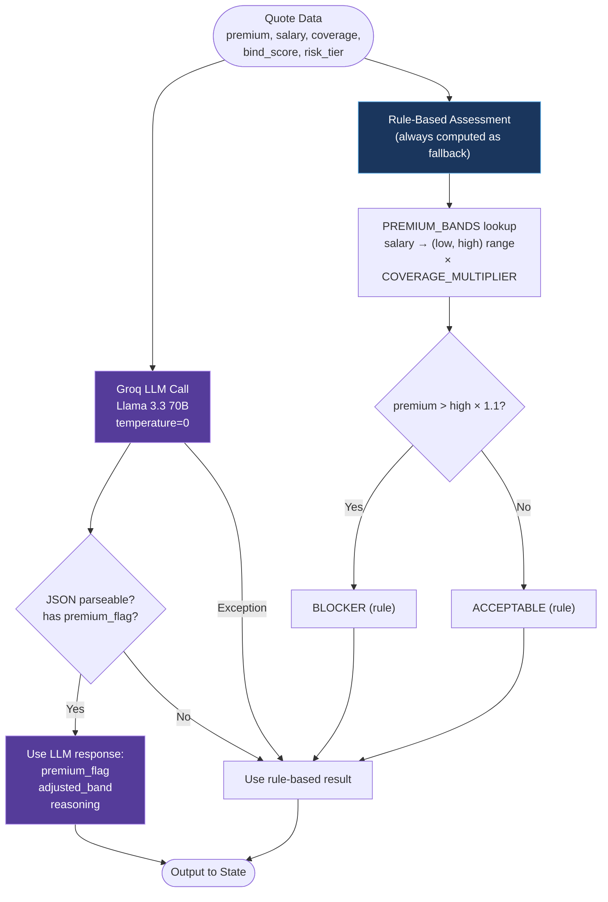

### Rule-Based Affordability Bands

| Salary Range | Base Premium Band | With Coverage Multiplier |
|-------------|-------------------|--------------------------|
| ≤ $25K | $400–$650 | × Basic=0.85, Balanced=1.0, Enhanced=1.15 |
| $25K–$40K | $500–$750 | × multiplier |
| $40K–$60K | $550–$850 | × multiplier |
| $60K–$90K | $600–$950 | × multiplier |
| > $90K | $650–$1,100 | × multiplier |

Premium is flagged as **BLOCKER** if `Quoted_Premium > adjusted_high × 1.1`.

### LLM Configuration

| Property | Detail |
|----------|--------|
| **Model** | Groq Llama 3.3 70B Versatile |
| **Temperature** | 0 (deterministic output) |
| **Output Format** | Structured JSON: `{premium_flag, adjusted_band_low, adjusted_band_high, reasoning, alternative_coverage}` |
| **Fallback** | If Groq API fails or returns malformed JSON → pure rule-based assessment |
| **JSON Parsing** | Robust parser handles markdown fences, partial JSON, nested objects |
| **Explainability** | Chain-of-thought prompting forces LLM to explain its reasoning |

### LLM Prompt Template

```
SYSTEM: You are an insurance premium analyst. You MUST respond with ONLY a valid JSON object.

USER: Analyze this auto insurance quote and determine if the premium is blocking conversion.
Quote context:
- Quoted Premium: ${quoted_premium}
- Coverage Type: {coverage}
- Salary Range: {sal_range}
- Vehicle Cost Range: {vehicl_cost_range}
- Re-Quote: {re_quote}
- Bind Score: {bind_score}/100
- Risk Tier: {risk_tier}
```

### Output

| Field | Type | Values |
|-------|------|--------|
| `premium_flag` | String | `BLOCKER` or `ACCEPTABLE` |
| `adjusted_band` | String | e.g., `"$550 - $850"` |
| `premium_reasoning` | String | Natural language explanation from LLM or rule-based text |

---

## 10. Agent 4 — Decision Router (LLM + Rules)

### Purpose

Combines signals from all upstream agents to determine the final routing decision. Generates structured case summaries for escalated quotes.

### Decision Logic

| Decision | Condition | Human Involved? |
|----------|-----------|-----------------|
| **AUTO_APPROVE** | risk=LOW, bind_score ≥ threshold, premium=ACCEPTABLE | No |
| **AGENT_FOLLOWUP** | bind_score 40–threshold, any risk, premium=ACCEPTABLE | No (agent nudge) |
| **ESCALATE_UNDERWRITER** | risk=HIGH + bind_score > 70 + premium=BLOCKER | Yes |
| **ESCALATE_UNDERWRITER** | Pipeline confidence < 0.55 on any agent | Yes |
| **ESCALATE_UNDERWRITER** | Re_Quote=Yes + risk=HIGH + bind_score < 40 | Yes |

### Dynamic Threshold Adjustment

The auto-approve threshold is **not static** — it adapts per region and agent type based on regional intelligence (from notebook 05):

```python
def get_regional_threshold(region, agent_type, base=75):
    # Blend region and channel thresholds when both available
    region_th = regional_stats[region]["auto_approve_threshold"]
    channel_th = regional_stats[agent_type]["auto_approve_threshold"]
    return round((region_th + channel_th) / 2)
```

### LLM-First Routing

Agent 4 uses the **LLM as the primary decision-maker** with rule-based fallback:

1. **LLM route** — Groq LLM receives full pipeline context (risk tier, bind score, premium flag, confidence, regional thresholds) and outputs `{decision, reasoning}` as structured JSON.
2. **Rule fallback** — If LLM fails or returns invalid response, threshold-based rules activate.

This satisfies the problem statement requirement of "trained model or LLM reasoning, not hardcoded rules."

### Case Summary Generation

For escalated quotes, Agent 4 generates a two-part case summary:

1. **Structured summary** — All upstream signals compiled into a readable format
2. **LLM narrative** (escalated only) — Groq generates a 3–5 sentence summary highlighting: (1) why escalated, (2) key risk factors, (3) recommended action

---

## 11. Explainability Stack (4+2 Methods)

This is the **key differentiator** of the project. Every agent decision is explainable through complementary methods, all computed **live at inference time** for every quote.

### Method Overview

| Method | What It Does | Best For | Timing |
|--------|-------------|----------|--------|
| **SHAP** | Game-theory feature importance — how each feature pushes prediction up/down | Global + local feature importance | ~5ms |
| **LIME** | Perturbs input locally, fits linear model to approximate decision boundary | Quick local "why this prediction?" | ~200ms |
| **Anchors** | Generates IF-THEN rules with precision/coverage metrics | Human-readable rules underwriters validate | ~1–5s |
| **DiCE** | Counterfactual explanations — "what needs to change?" | **Actionable recommendations** | ~1–3s |
| **Chain-of-Thought** | LLM forced to explain reasoning step-by-step | Premium analysis reasoning | ~2s |
| **Structured Summary** | All signals compiled into readable case summary + LLM narrative | Underwriter handoff | ~2s |

### Per-Agent Explainability Matrix

| Agent | SHAP | LIME | Anchors | DiCE | LLM CoT | Case Summary |
|-------|------|------|---------|------|---------|--------------|
| Agent 1 — Risk Profiler | ✓ Live | ✓ Live | ✓ Live | ✓ Live | — | — |
| Agent 2 — Conversion Predictor | ✓ Live | ✓ Live | ✓ Live | ✓ Live | — | — |
| Agent 3 — Premium Advisor | — | — | — | — | ✓ Live | — |
| Agent 4 — Decision Router | — | — | — | — | ✓ (escalated) | ✓ Always |

### How It Works at Inference

1. **Notebooks save XAI bundles** — `risk_xai_bundle.joblib` and `conversion_xai_bundle.joblib` containing training data samples and feature metadata
2. **Backend loads bundles at startup** — lazy-initializes LIME, Anchor, and DiCE explainers on first request
3. **Every quote gets all 4 explanations** computed on-the-fly:
   - SHAP: ~5ms (TreeExplainer, pre-loaded)
   - LIME: ~200ms (local perturbation)
   - Anchors: ~1–5s (rule search, threshold relaxed to 0.75)
   - DiCE: ~1–3s (counterfactual generation, genetic method)
4. **All explanations returned in the API response** and streamed to the frontend per agent via SSE

### XAI Bundle Contents

| Artifact | Contents | Used By |
|----------|----------|---------|
| `risk_xai_bundle.joblib` | 1K-row numeric training sample, cat_value_maps, anchor categorical_names, 5K-row DiCE DataFrame, continuous features list | Agent 1 backend |
| `conversion_xai_bundle.joblib` | 1K-row SMOTE training sample, 5K-row DiCE DataFrame, prediction threshold, continuous features list | Agent 2 backend |
| `risk_explainer.joblib` | SHAP TreeExplainer for CatBoost | Agent 1 SHAP |
| `conversion_explainer.joblib` | SHAP TreeExplainer for CatBoost | Agent 2 SHAP |

### Frontend Display

| Method | Frontend Component |
|--------|--------------------|
| SHAP | Horizontal bar chart (green/red bars per feature) |
| LIME | Feature weight list with +/− indicators |
| Anchors | Highlighted rule block with precision badge |
| DiCE | "What-if" cards showing minimal changes needed |
| LLM CoT | Expandable text block |
| Case Summary | Full case card with all signals |

### Why 4 Methods (Not Just SHAP)

SHAP answers **"what matters?"** but doesn't answer **"what should we do?"** DiCE answers the actionable question. Anchors give underwriters rules they already think in. LIME provides a quick local sanity check. Together, they cover the full spectrum from understanding to action.

---

## 12. LangGraph Pipeline Orchestration

### State Schema

```python
class QuoteState(TypedDict, total=False):
    # Raw input
    quote_num: str
    agent_type: str          # EA | IA
    region: str
    re_quote: bool
    quoted_premium: float
    coverage: str            # Basic | Balanced | Enhanced
    sal_range: str
    vehicl_cost_range: str
    veh_usage: str
    annual_miles_range: str
    raw_features: dict       # All input columns

    # Agent 1 outputs
    risk_tier: str           # LOW | MEDIUM | HIGH
    risk_score: float
    risk_shap: dict          # Top 5 SHAP features {name: value}
    risk_lime: dict          # LIME weights {feature_condition: weight}
    risk_anchors: dict       # {rule: str, precision: float, coverage: float}
    risk_counterfactuals: list  # DiCE counterfactual dicts

    # Agent 2 outputs
    bind_score: int          # 0–100
    bind_probability: float
    bind_shap: dict
    bind_lime: dict
    bind_anchors: dict
    bind_counterfactuals: list
    urgency_days: int

    # Agent 3 outputs (conditional)
    premium_flag: str        # BLOCKER | ACCEPTABLE
    adjusted_band: str
    premium_reasoning: str

    # Agent 4 outputs
    decision: str            # AUTO_APPROVE | AGENT_FOLLOWUP | ESCALATE_UNDERWRITER
    routing_reasoning: str
    case_summary: str
    auto_approve_threshold: int
    confidence: float
```

### Graph Wiring

```mermaid
stateDiagram-v2
    [*] --> risk_profiler: Entry Point

    risk_profiler --> conversion_predictor: always

    conversion_predictor --> premium_advisor: bind_score > threshold
    conversion_predictor --> decision_router: bind_score ≤ threshold<br/>(skip Agent 3)

    premium_advisor --> decision_router: always

    decision_router --> [*]: END

    state risk_profiler {
        note left of risk_profiler
            Agent 1: CatBoost 3-class
            + SHAP + LIME + Anchors + DiCE
        end note
    }

    state conversion_predictor {
        note left of conversion_predictor
            Agent 2: CatBoost binary + SMOTE
            + SHAP + LIME + Anchors + DiCE
        end note
    }

    state premium_advisor {
        note left of premium_advisor
            Agent 3: Groq LLM + Rules
            Chain-of-Thought reasoning
        end note
    }

    state decision_router {
        note left of decision_router
            Agent 4: LLM + Rules
            Regional threshold adaptation
        end note
    }
```

**Code equivalent:**

```python
graph = StateGraph(QuoteState)

graph.add_node("risk_profiler",        agent1_risk_profiler)
graph.add_node("conversion_predictor", agent2_conversion_predictor)
graph.add_node("premium_advisor",      agent3_premium_advisor)
graph.add_node("decision_router",      agent4_decision_router)

graph.set_entry_point("risk_profiler")
graph.add_edge("risk_profiler", "conversion_predictor")

# Conditional: Agent 3 only for high bind_score quotes
graph.add_conditional_edges(
    "conversion_predictor",
    _should_run_premium_advisor,
    {"premium_advisor": "premium_advisor", "decision_router": "decision_router"}
)

graph.add_edge("premium_advisor", "decision_router")
graph.add_edge("decision_router", END)

pipeline = graph.compile()
```

### Conditional Edge Logic

The premium advisor threshold is loaded from the model comparison bundle or defaults to 60:

```python
def _should_run_premium_advisor(state):
    if state["bind_score"] > threshold:
        return "premium_advisor"     # Run Agent 3
    else:
        state["premium_flag"] = "ACCEPTABLE"  # Skip Agent 3, set defaults
        return "decision_router"
```

This saves Groq API calls (~60–70% of quotes skip Agent 3) and focuses premium analysis on quotes with actual conversion potential.

---

## 13. Regional & Channel Intelligence

### Notebook: `05_Regional_Intelligence.ipynb`

This addresses the problem statement's bonus requirement for regional and channel analysis.

### Findings

| Region | Bind Rate | EA Bind Rate | IA Bind Rate |
|--------|-----------|-------------|-------------|
| A | 22.23% | ~22.1% | ~22.4% |
| B | 22.08% | ~22.0% | ~22.2% |
| C | 22.56% | ~22.4% | ~22.6% |
| D | 22.15% | ~22.1% | ~22.3% |
| E | 22.31% | ~22.2% | ~22.4% |
| F | 22.18% | ~22.1% | ~22.3% |
| G | 22.25% | ~22.1% | ~22.3% |
| H | 22.41% | ~22.3% | ~22.5% |

**Key insight:** Regional and channel differences are tiny (fractions of percentage points), but the system still adapts thresholds based on whatever signal exists.

### Dynamic Threshold System

| Parameter | Value |
|-----------|-------|
| Base auto-approve threshold | 75.0 |
| Scale per percentage point | 2.0 |
| Threshold range | 74.3 (Region H) – 75.3 (Region B) |
| Channel thresholds | EA: 75.1, IA: 74.7 |
| Min/Max bounds | 72.0 – 78.0 |

### Implementation

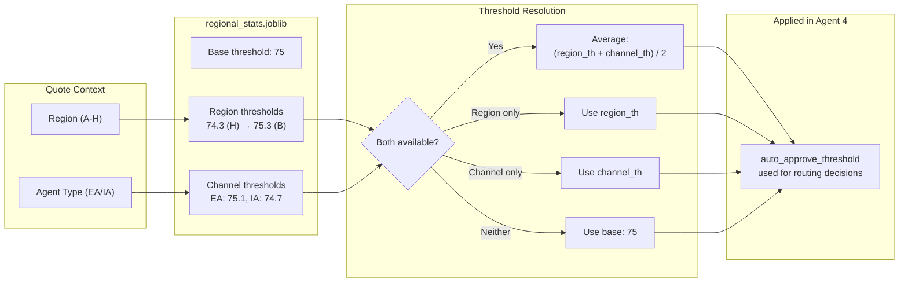

**Code:**

```python
# Computed once at startup from full dataset
regional_stats = df.groupby(["Region", "Agent_Type"]).agg(
    total_quotes=("Quote_Num", "count"),
    bound_quotes=("Policy_Bind_enc", "sum"),
    bind_rate=("Policy_Bind_enc", "mean"),
    avg_premium=("Quoted_Premium", "mean"),
).reset_index()

# Dynamic threshold: higher bind rate → lower threshold (more auto-approves)
adjustment = (region_rate - overall_rate) * SCALE_PER_PERCENT_POINT
threshold = base - adjustment
```

### Saved Artifact

`regional_stats.joblib` contains:
- Per-region and per-channel bind rates
- Dynamic threshold values for each region and agent type
- Base threshold configuration

---

## 14. Backend API Architecture

### Framework: FastAPI + Uvicorn (ASGI)

### Endpoints

| Method | Path | Purpose |
|--------|------|---------|
| `POST` | `/api/process-quote` | Process single quote through 4-agent pipeline |
| `POST` | `/api/process-batch` | Process multiple quotes sequentially, collecting results |
| `GET` | `/api/stream` | SSE endpoint — pushes each processed quote to connected clients |
| `GET` | `/api/quotes` | Get processed quotes with filtering (by decision, pagination) |
| `GET` | `/api/stats` | Aggregate statistics (decisions, risk tiers, bind scores, histogram) |
| `GET` | `/api/regional-stats` | Per-region and per-channel bind rates + dynamic thresholds |
| `GET` | `/api/sample-quotes` | Load N random quotes from dataset for demo |
| `GET` | `/health` | Health check |

### Persistence Mode (In-Memory + Supabase Fallback)

The backend supports two storage modes:

1. **In-memory list** (`processed_quotes`) for local-only runs
2. **Supabase persistent store** (`public.quote_runs`) when env vars are set

Activation conditions:

- `SUPABASE_URL` (or `NEXT_PUBLIC_SUPABASE_URL` fallback)
- `SUPABASE_SERVICE_ROLE_KEY` (preferred)

Behavior:

- `/api/process-quote` and `/api/process-batch` write to in-memory and Supabase (best-effort)
- `/api/quotes`, `/api/stats`, `/api/regional-stats` read from Supabase when enabled, else in-memory
- On Supabase read/write errors, API falls back to in-memory and logs warnings

### Input Schema

```json
{
  "Quote_Num": "AQ-C-139212",
  "Agent_Type": "EA",
  "Region": "A",
  "Driver_Age": 34,
  "Driving_Exp": 12,
  "Prev_Accidents": 0,
  "Prev_Citations": 1,
  "Coverage": "Enhanced",
  "Quoted_Premium": 1245.00,
  "Sal_Range": "> $ 40 K <= $ 60 K",
  ...
}
```

### Output Schema (per quote)

```json
{
  "quote_num": "AQ-C-139212",
  "risk_tier": "LOW",
  "risk_score": 0.94,
  "risk_shap": {"Prev_Accidents": -0.32, "Driving_Exp": -0.21, ...},
  "risk_lime": {"Prev_Accidents ≤ 0": -0.28, ...},
  "risk_anchors": {"rule": "IF Prev_Accidents = 0...", "precision": 0.94, "coverage": 0.31},
  "risk_counterfactuals": [{"Prev_Accidents": 2, "Driver_Age": 22, ...}],
  "bind_score": 51,
  "bind_probability": 0.51,
  "bind_shap": {"Quoted_Premium": -0.12, ...},
  "bind_lime": {...},
  "bind_anchors": {...},
  "bind_counterfactuals": [...],
  "urgency_days": 59,
  "premium_flag": "ACCEPTABLE",
  "adjusted_band": "$550 - $850",
  "premium_reasoning": "Premium falls within expected range...",
  "decision": "AGENT_FOLLOWUP",
  "case_summary": "=== CASE SUMMARY ===...",
  "confidence": 0.87,
  "timestamp": "2026-03-05T10:30:00Z"
}
```

### Server-Sent Events (SSE)

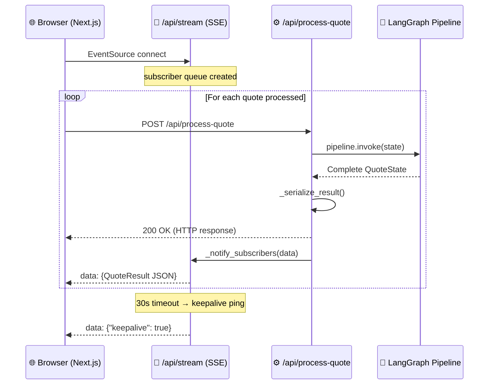

The `/api/stream` endpoint pushes real-time updates to the frontend:

```
Event: agent_start    → {"quote_id": "Q-123", "agent": 1, "agent_name": "Risk Profiler"}
Event: agent_complete → {"quote_id": "Q-123", "agent": 1, "output": {...}}
Event: agent_skipped  → {"quote_id": "Q-123", "agent": 3, "reason": "bind_score ≤ 60"}
Event: pipeline_complete → {"quote_id": "Q-123", "decision": "AUTO_APPROVE", ...}
```

### CORS Configuration

Allows connections from `http://localhost:3000` (Next.js dev server).

### Error Handling

- Safe label encoding with fallback to 0 for unseen categorical values
- Groq API failures gracefully fall back to rule-based logic
- JSON serialization handles numpy types, ndarrays, and nested structures
- Pipeline errors return structured error responses with quote IDs

---

## 15. Frontend Dashboard

### Framework: Next.js 16 (App Router) + shadcn/ui + Tailwind CSS + Recharts

### Application Routes

| Route | Page | Description |
|-------|------|-------------|
| `/` | Landing | Bento-grid overview of the entire system |
| `/quotes` | Live Quotes Console | Custom input form + sample loading + live processing table |
| `/pipeline` | Pipeline Graph | Visual pipeline stepper with per-agent status |
| `/analytics` | Analytics Dashboard | Bind score histogram, risk tier breakdown, decision distribution |
| `/escalations` | Escalation Queue | Escalated quotes with full case summaries and XAI tabs |
| `/regional` | Regional Intelligence | Per-region bind rates, EA vs IA comparison, dynamic thresholds |

### Key Components (34 total .tsx files)

| Component | Location | Purpose | Lines |
|-----------|----------|---------|-------|
| `AnalyticsDashboard` | `components/analytics/` | Recharts BarChart + PieChart for risk/decision distributions | 286 |
| `DecisionBadge` | `components/badges/` | Color-coded decision pill (green/blue/red) | 35 |
| `PremiumBadge` | `components/badges/` | BLOCKER/ACCEPTABLE status badge | 31 |
| `RiskBadge` | `components/badges/` | LOW/MEDIUM/HIGH risk tier badge | 43 |
| `EscalationQueue` | `components/escalation/` | Expandable escalation cards with 4 XAI tabs | 241 |
| `ShapDisplay` | `components/explainability/` | Horizontal SHAP impact bar chart | 62 |
| `LimeDisplay` | `components/explainability/` | Bidirectional LIME weight bars | 57 |
| `AnchorDisplay` | `components/explainability/` | IF-THEN anchor rule in monospace box | 17 |
| `CounterfactualDisplay` | `components/explainability/` | DiCE original-vs-changed cards | 50 |
| `DotGrid` | `components/landing/` | GSAP-animated interactive dot background | 309 |
| `MagicBento` | `components/landing/` | GSAP bento grid with spotlight + tilt + particles | 642 |
| `AppHeader` | `components/layout/` | Sticky header with SSE status indicator | 39 |
| `AppShell` | `components/layout/` | Root shell (Sidebar + Header + content) | 18 |
| `Sidebar` | `components/layout/` | Fixed nav with 5 routes + "Run Pipeline" action | 153 |
| `PipelineViewer` | `components/pipeline/` | 4-step pipeline stepper with XAI expansion | 312 |
| `QuoteFilters` | `components/quote/` | Risk/decision/region filter dropdowns | 76 |
| `QuoteTable` | `components/quote/` | Data table with expandable XAI rows | 255 |
| `RegionalIntelligence` | `components/regional/` | Region bar charts + EA/IA comparison table | 247 |
| shadcn/ui primitives | `components/ui/` | 17 components: Badge, Button, Card, Input, Label, Progress, ScrollArea, Select, Separator, Skeleton, Slider, Switch, Table, Tabs, Tooltip, GlowingEffect, Demo | — |

### Design System

- **Color coding:** LOW=green, MEDIUM=amber, HIGH=red (risk); AUTO_APPROVE=green, FOLLOWUP=blue, ESCALATE=red (decisions)
- **Typography:** Clean, professional dashboard aesthetic
- **Animations:** GSAP + Motion for smooth transitions
- **Responsive:** Fully responsive bento-grid layout

### Quote Input Modes

**Mode 1 — Custom Quote Form:**
A structured form with 18 fields (dropdowns, sliders, steppers, toggles) for manual quote entry. Quote_Num auto-generated, dates set to current.

**Mode 2 — Sample Batch:**
"Load N Samples" button pulls random rows from the dataset. User can preview and process all at once.

### Pipeline Visualization

Each quote shows a **visual pipeline stepper** that updates in real time:

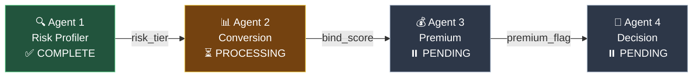

Agent explanation panels expand below the stepper as each agent completes.

---

## 16. Technology Stack

### Backend

| Library / Tool | Version | Purpose |
|---------------|---------|---------|
| Python | 3.11+ | Core language |
| FastAPI | Latest | REST API server |
| Uvicorn | Latest | ASGI server |
| LangGraph | 0.2.x | Multi-agent StateGraph orchestration |
| LangChain + langchain-groq | Latest | Groq Llama 3.3 70B integration |
| Pydantic | v2 | Typed state schema |
| SSE (Starlette) | Built-in | Server-Sent Events streaming |

### Machine Learning

| Library | Purpose |
|---------|---------|
| pandas | Data manipulation, feature engineering |
| scikit-learn | Preprocessing, train/test split, metrics |
| imbalanced-learn | SMOTE oversampling |
| CatBoost | Agent 1 (risk) + Agent 2 (bind) classifiers |
| SHAP | TreeExplainer for both models |
| DiCE (dice-ml) | Counterfactual explanations |
| LIME | Local interpretable model-agnostic explanations |
| Alibi | Anchor rule-based explanations |
| joblib | Model serialization |

### Frontend

| Library | Version | Purpose |
|---------|---------|---------|
| Next.js | 16.1.6 | React framework (App Router) |
| React | 19.2.3 | UI library |
| shadcn/ui | 3.8.5 | Component library |
| Tailwind CSS | v4 | Utility-first styling |
| Recharts | 3.7.0 | Data visualization charts |
| Lucide React | Latest | Icon library |
| GSAP | 3.13.0 | Animation library |
| Motion | 12.35.0 | React animation |

### Infrastructure

| Component | Detail |
|-----------|--------|
| LLM Provider | Groq (free tier) — 30 RPM, 14,400 daily requests |
| LLM Model | Llama 3.3 70B Versatile (131K context window) |
| Communication | SSE for real-time frontend updates |
| Dataset | Single CSV, 146K rows |

---

## 17. Why Bind Prediction Stayed Weak — Honest Assessment

### The Core Issue

We tried **3 model variants** (baseline SMOTE, focal reweighting, PU learning), engineered **3 domain features**, tested **5 different model architectures** (Ridge, Random Forest, CatBoost, MLP, Ensemble), and swept thresholds with guardrails. The best PR-AUC is **0.2242** — barely above the 22% base rate — confirming bind prediction is near-random given these features.

### Why This Happened

| Factor | Evidence |
|--------|----------|
| **Features lack predictive signal** | Most features look similar for binders and non-binders |
| **Regional bind rates nearly flat** | 22.08%–22.56% across 8 regions — geography adds no discrimination |
| **Channel bind rates flat** | EA 22.16% vs IA 22.38% — agent type adds nothing |
| **Coverage bind rates flat** | 22.0%–22.3% across Basic/Balanced/Enhanced |
| **urgency_days is constant** | Every row = 59 days — zero variance, zero signal |
| **Score distributions overlap** | Both classes centered around ~50 bind score |
| **All model architectures give same result** | Ridge, RF, CatBoost, MLP — all ~0.50 ROC-AUC |

### What "Signal Quality" Means

A feature has good signal if its values differ meaningfully between binders and non-binders. In this dataset, most features look similar across both groups. Handling class imbalance (SMOTE, focal, PU) is technically correct but **does not add new information** — it only corrects the model's class prior.

### Executive Summary

> **"We solved imbalance technically (SMOTE + focal + PU), but the available features contain limited information about bind behavior, so the ceiling of predictive performance is near random ranking."**

### What Would Improve Performance in Production

Real insurance conversion often depends on variables **not in this dataset**:

| Missing Variable | Why It Matters |
|-----------------|----------------|
| Quote-to-bind delay / follow-up timing | Conversion is time-sensitive |
| Agent interaction quality (call duration, sentiment) | Agent skill is a major driver |
| Competitor pricing at quote time | Price comparison shopping behavior |
| Customer intent signals (session behavior, return frequency) | Digital engagement patterns |
| Macro or seasonal effects | Holiday periods, rate cycle timing |
| Browsing behavior, time-on-page | Online engagement quality |

### Despite Weak Prediction, Explainability Adds Value

The model outputs useful **SHAP/LIME/Anchors/DiCE explanations** that help agents understand which factors matter, even when the absolute predictive lift is small. An agent seeing "this quote's premium is above the affordability band for this salary range" or "this is a re-quote with high risk" gains **actionable insight** regardless of the bind score's absolute accuracy.

---

## 18. What We Did Right — Defense Points

| What We Did | Why It Matters |
|-------------|---------------|
| **Used SMOTE as required** | Problem statement explicitly requires handling class imbalance |
| **Tested multiple robust methods** | CatBoost, focal-style reweighting, PU learning, threshold tuning |
| **Tested 5 model architectures** | Ridge, RF, CatBoost, MLP, Ensemble — proved ceiling is data-limited |
| **Added domain-engineered features** | affordability_ratio, hh_need, risk_coverage_fit — injected domain knowledge |
| **Built full explainability stack** | 4 computationally distinct methods (SHAP + LIME + Anchors + DiCE) — all live at inference |
| **Concluded transparently from evidence** | Presented honest metrics, didn't inflate numbers or hide weak results |
| **Cited relevant research** | Saito & Rehmsmeier (2015), Lin (2017), Shen & Xiu (2024), du Plessis (2015), Elkan (2001) |
| **Built production-ready pipeline** | LangGraph orchestration, FastAPI API, SSE streaming, regional thresholds |
| **Hybrid ML + LLM approach** | ML for classification (Agents 1–2), LLM for reasoning (Agents 3–4) |
| **Regional intelligence** | Dynamic threshold adaptation per region and channel |
| **Defensive engineering** | Fallbacks for LLM failures, unseen categories, missing features, JSON parsing |

---

## 19. Production Roadmap

### Immediate Improvements (with additional data)

| Enhancement | Impact |
|-------------|--------|
| Add browsing/session behavior features | Significant lift in bind prediction |
| Add agent call duration / follow-up timing | Capture agent interaction quality |
| Add competitor pricing context | Understand price-shopping behavior |
| Real-time model retraining pipeline | Adapt to shifting conversion patterns |
| A/B test threshold adjustments | Optimize approval/escalation balance |

### Architecture Scaling

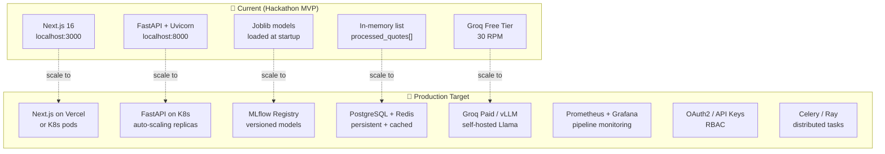

| Component | Current | Production |
|-----------|---------|------------|
| Data store | In-memory list | PostgreSQL + Redis cache |
| Model serving | Loaded at startup | MLflow model registry + versioning |
| Pipeline | Single-process LangGraph | Distributed task queue (Celery/Ray) |
| Monitoring | None | Prometheus + Grafana dashboards |
| Auth | None | OAuth2 / API key management |
| Deployment | Local | Kubernetes + auto-scaling |

---

## 20. Project Structure

```
AI-DAY-T23-AUTONOMOUS-QUOTE-AGENTS/
│
├── ML/
│   ├── datasets/
│   │   └── insurance_quotes.csv              # 146K-row source dataset
│   ├── notebooks/
│   │   ├── 01_EDA.ipynb                       # Exploratory data analysis
│   │   ├── 02_Feature_Engineering.ipynb       # All encoding + feature creation
│   │   ├── 03_Agent1_Risk_Profiler.ipynb      # CatBoost + 4 XAI methods
│   │   ├── 04_Agent2_Conversion_Predictor.ipynb  # CatBoost + SMOTE + 4 XAI methods
│   │   ├── 04b_Model_Comparison_Ridge_RF.ipynb               # 5-model comparison
│   │   └── 05_Regional_Intelligence.ipynb     # Regional stats + thresholds
│   ├── models/
│   │   ├── risk_model.joblib                  # CatBoost risk classifier
│   │   ├── risk_explainer.joblib              # SHAP TreeExplainer (risk)
│   │   ├── risk_xai_bundle.joblib             # LIME/Anchors/DiCE artifacts (risk)
│   │   ├── risk_cat_value_maps.joblib         # CatBoost categorical maps
│   │   ├── conversion_model.joblib            # CatBoost bind classifier
│   │   ├── conversion_explainer.joblib        # SHAP TreeExplainer (bind)
│   │   ├── conversion_xai_bundle.joblib       # LIME/Anchors/DiCE artifacts (bind)
│   │   ├── conversion_model_comparison_bundle.joblib  # Model comparison results
│   │   ├── conversion_scaler.joblib           # Feature scaler
│   │   ├── feature_config.joblib              # Feature lists for both agents
│   │   ├── label_encoders.joblib              # Categorical encoders
│   │   ├── ordinal_maps.joblib                # Ordinal encoding maps
│   │   ├── regional_stats.joblib              # Regional bind rates + thresholds
│   │   ├── train.parquet                      # Training data
│   │   └── test.parquet                       # Test data
│   └── requirements.txt
│
├── Backend/
│   ├── agents/
│   │   ├── agent1_risk_profiler.py            # CatBoost + SHAP/LIME/Anchors/DiCE (347 lines)
│   │   ├── agent2_conversion_predictor.py     # CatBoost + SMOTE + all 4 XAI (307 lines)
│   │   ├── agent3_premium_advisor.py          # Groq LLM + rule fallback (170 lines)
│   │   └── agent4_decision_router.py          # LLM routing + case summary (272 lines)
│   ├── pipeline/
│   │   ├── state.py                           # QuoteState TypedDict schema
│   │   └── graph.py                           # LangGraph StateGraph wiring
│   ├── api/
│   │   ├── main.py                            # FastAPI app + CORS + health
│   │   └── routes.py                          # 7 API endpoints + SSE streaming
│   ├── models/
│   │   └── __init__.py                        # Pydantic models package (placeholder)
│   └── requirements.txt
│
├── Frontend/
│   ├── src/
│   │   ├── app/
│   │   │   ├── page.tsx                       # Landing page (bento grid)
│   │   │   ├── quotes/page.tsx                # Live quotes console
│   │   │   ├── pipeline/page.tsx              # Pipeline visualization
│   │   │   ├── analytics/page.tsx             # Analytics dashboard
│   │   │   ├── escalations/page.tsx           # Escalation queue
│   │   │   └── regional/page.tsx              # Regional intelligence
│   │   ├── components/
│   │   │   ├── analytics/                     # Charts and metrics
│   │   │   ├── badges/                        # Risk, decision, premium badges
│   │   │   ├── escalation/                    # Escalation queue + XAI tabs
│   │   │   ├── explainability/                # SHAP/LIME/Anchors/DiCE display
│   │   │   ├── pipeline/                      # Pipeline stepper + status
│   │   │   ├── quote/                         # Quote form + table
│   │   │   ├── regional/                      # Regional charts + thresholds
│   │   │   └── ui/                            # shadcn/ui primitives
│   │   └── lib/
│   │       ├── api.ts                         # Backend API client + transformers
│   │       ├── types.ts                       # TypeScript interfaces (QuoteResult, etc.)
│   │       ├── mock-data.ts                   # Demo mock data
│   │       └── utils.ts                       # Utility functions
│   └── package.json
│
├── Docs/
│   ├── MVP_Plan.md                            # Detailed MVP build plan
│   └── Technical_Documentation.md             # This document
│
├── UC3_MVP_Plan.md                            # Root copy of MVP plan
├── README.md                                  # Project overview
└── package.json                               # Root workspace config
```

---

## Appendix A: Groq API Limits

| Model | RPM | Daily Requests | Context |
|-------|-----|----------------|---------|
| Llama 3.3 70B Versatile | 30 | 14,400 | 131K tokens |

- Agent 3 only fires when `bind_score > threshold` (~30–40% of quotes)
- Agent 4 LLM summary only fires for ESCALATE decisions (~10–15% of quotes)
- Processing 100 demo quotes ≈ ~40 Groq calls — well within limits
- Retry + backoff wrapper for rate limit safety

## Appendix B: Risks and Mitigations

| Risk | Likelihood | Mitigation |
|------|------------|------------|
| Groq returns malformed JSON | Medium | try/except with rule-based fallback; robust JSON parser handles markdown fences |
| SMOTE overfitting | Low-Medium | Validate on held-out test set at real 22% distribution |
| SSE connection drops | Low | Auto-reconnect EventSource with exponential backoff |
| Dirty dates in Q_Valid_DT | Medium | Parse with coerce, fill nulls with median urgency |
| Groq rate limiting during demo | Low | Cache Agent 3 responses; conditional invocation reduces calls |
| Pipeline too slow for live demo | Low-Medium | SHAP always fast; LIME/Anchors/DiCE lazy-loaded, can be made on-demand |
| CatBoost categorical mismatch at inference | Low | cat_features indices saved; raw strings passed directly to CatBoost Pool |
| Unseen categorical values at inference | Low | `_safe_encode_label()` falls back to 0 |

## Appendix C: Notebook Run Order

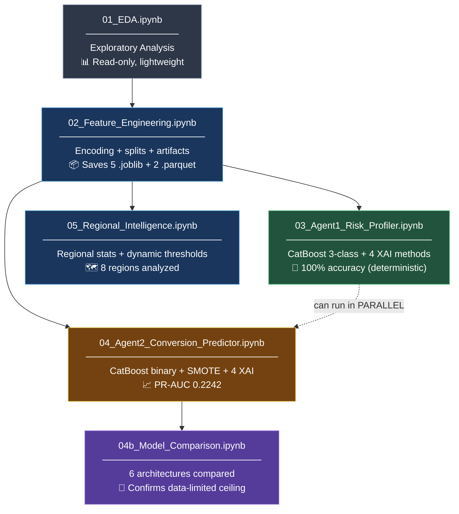

**Machine assignment suggestion:**
- Desktop (RTX 4060Ti, 16GB): Notebook 03 (CatBoost supports GPU if needed)
- MacBook M4 / Gaming laptop: Notebook 04 (CPU-only, fast)
- Any machine: 01, 02, 05 are lightweight

---

*Autonomous Quote Agents — KodryxAI Hackathon 2026 — Use Case 3*
*Comprehensive Technical Documentation v2.0 — with Mermaid Architecture Diagrams*
